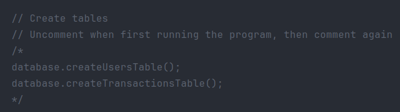

*Copyright (C) 2023 Cismaru Diana-Iuliana*

# ATM Interface

### Description of the project
This project implements a simple **ATM Command-Line Interface**. It allows 
users to create accounts, perform banking transactions and manage their
finances securely.

## Table of Contents
- [Features](#features)
- [Prerequisites](#prerequisites)
- [Usage](#usage)
    - [Creating a new account](#creating-a-new-account)
    - [Accessing the ATM](#accessing-the-atm)
- [Contributing](#contributing)

## Features
- Account creation
- Secure login using UID and PIN code
- Deposit funds
- Withdraw funds
- Transfer funds between accounts
- View bank statements
- Check account balance
- Change PIN code

## Prerequisites
When first running the program, you must create the two tables: *users* and
*transactions*. There are two commented method calls that create these tables 
in the *main* method. You should uncomment these lines when first running the
program, them comment them again. The RDBMS used is **PostgreSQL**.

## Usage
* **Creating a new account**

Follow the promts to provide user details. The program uses **regular
expressions** to ensure valid credentials. The PIN code must consist of
exactly 4 digits and should not contain 4 consecutive identical digits. The
PIN is **securely hashed** using the **SHA-256 algorithm** before storage, as
well as a **unique 6-digit** UID is generated.

* **Accessing the ATM**

To access the ATM features, you have to select the second option from the main
menu. You will be prompted to log in with a valid user by providing the UID
and PIN code. Only **three login attempts** are allowed before the ATM turns
off. Authentication is performed by searching the existing **user cache**
retrieved from the database.

Once logged in, you can choose from the following options:

1. Deposit
2. Withdraw
3. Transfer
4. Bank Statement
5. Balance
6. Change PIN Code
7. Exit

For the first three options, an **abstract class** called **Transaction** with
a **Factory Method Design Pattern** is utilized. Depending on the selected
option, an instance of Deposit, Withdrawal or Transfer is created, and
specific transaction operations are executed.

**Bank Statament** option displays user account details, including name, UID,
transaction history and current balance, retrieved from the database.

**Change PIN Code** allows the user to change their PIN code, ensuring it
meets security criteria

If the **Exit** option is chosen, the ATM turns off.

## Contributing
Contributions are welcomed! If you'd like to contribute to this project,
please fork the repository and create a pull request with your proposed
changes or new ideas.